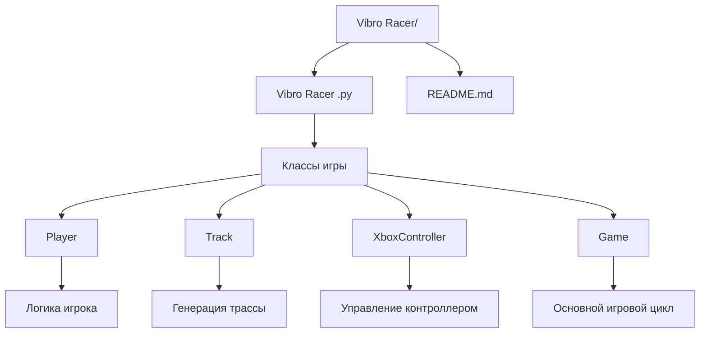
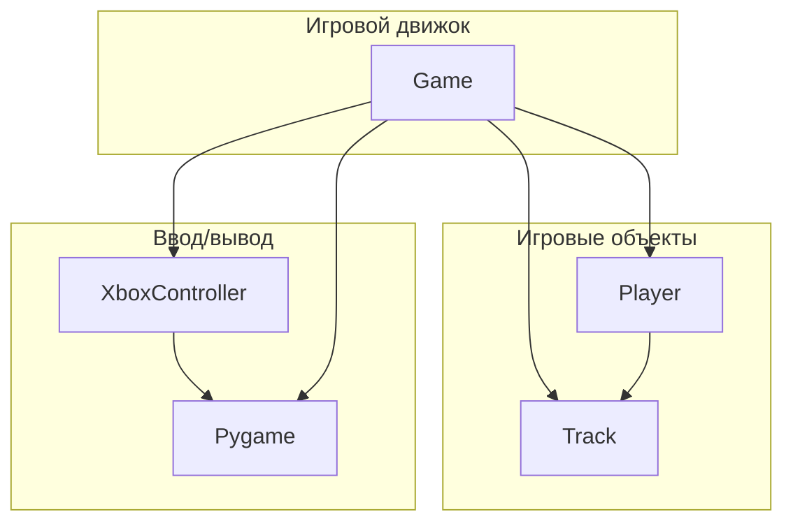
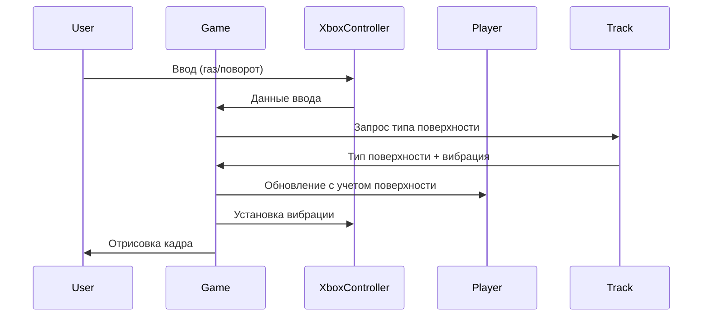

# Vibro Racer - Документация проекта

## Описание проекта

**Vibro Racer** - это 2D гоночная игра с видом сверху, разработанная на Python с использованием библиотеки Pygame. Особенностью игры является поддержка тактильной обратной связи через Xbox контроллер с вибрацией, которая изменяется в зависимости от типа поверхности трассы.

## 1. Структура проекта

```
Vibro Racer/
├── Vibro Racer.py    # Основной файл игры
└── README.md          # Документация проекта
```

### Дерево файлов и папок



## 2. Описание файлов

### Vibro Racer .py

**Назначение:** Основной файл игры, содержащий всю игровую логику и классы.

**Ключевые функции/классы:**

#### Класс `Player`
- **Назначение:** Управляет игровым персонажем (машиной)
- **Ключевые методы:**
  - `update()` - обновление позиции и физики
  - `bounce()` - анимация подпрыгивания
  - `draw()` - отрисовка на экране
- **Связи:** Взаимодействует с `Track` для получения типа поверхности

#### Класс `Track`
- **Назначение:** Генерирует и управляет трассой
- **Ключевые методы:**
  - `generate_track()` - создание случайной трассы
  - `get_surface_at()` - определение типа поверхности в точке
  - `draw()` - отрисовка трассы
- **Связи:** Предоставляет данные о поверхности для `Player` и `Game`

#### Класс `XboxController`
- **Назначение:** Обработка ввода с Xbox контроллера
- **Ключевые методы:**
  - `get_input()` - получение ввода
  - `set_vibration()` - управление вибрацией
- **Связи:** Интегрируется с `Game` для управления

#### Класс `Game`
- **Назначение:** Основной игровой движок
- **Ключевые методы:**
  - `run()` - главный игровой цикл
  - `update()` - обновление игровой логики
  - `render()` - отрисовка
  - `handle_input()` - обработка ввода
- **Связи:** Координирует работу всех остальных классов

**Логика:** Игра использует объектно-ориентированный подход с четким разделением ответственности между классами.

## 3. Архитектура проекта

### Общая структура



### Потоки данных



## 4. Библиотеки/фреймворки

### Pygame
- **Назначение:** Основная библиотека для создания 2D игр
- **Использование:**
  - Отрисовка графики (`pygame.display`, `pygame.draw`)
  - Обработка событий (`pygame.event`)
  - Работа с джойстиками (`pygame.joystick`)
  - Управление временем (`pygame.time.Clock`)

### Стандартные библиотеки Python
- **math** - математические вычисления (тригонометрия для движения)
- **random** - генерация случайных элементов трассы
- **sys** - системные функции (выход из программы)
- **time** - измерение времени игры

## 5. Точка входа и запуск

### Как запускается проект

```python
if __name__ == "__main__":
    game = Game()
    game.run()
```

### Что выполняется первым

1. **Инициализация Pygame** - настройка графической системы
2. **Создание игровых объектов:**
   - `Player` - игрок в позиции (200, 200)
   - `Track` - генерация трассы 3200x2400 пикселей
   - `XboxController` - подключение контроллера
3. **Запуск главного цикла** - `game.run()`

## 6. Архитектурные особенности

### Нестандартные решения

1. **Тактильная обратная связь**
   - Вибрация контроллера зависит от типа поверхности
   - Уникальная особенность для 2D гоночных игр

2. **Процедурная генерация трассы**
   - Трасса генерируется случайно при каждом запуске
   - Разные типы поверхностей влияют на физику

3. **Гибридное управление**
   - Поддержка как Xbox контроллера, так и клавиатуры
   - Автоматическое переключение между режимами

### Причины выбора архитектуры

1. **Модульность** - каждый класс отвечает за свою область
2. **Расширяемость** - легко добавить новые типы поверхностей или механики
3. **Производительность** - оптимизированная отрисовка только видимых частей трассы
4. **Пользовательский опыт** - тактильная обратная связь повышает иммерсивность

## 7. Технические детали

### Система поверхностей

| Тип | Цвет | Трение | Вибрация | Описание |
|-----|------|--------|----------|----------|
| 0 | Черный | 0.02 | Нет | Обычная дорога |
| 1 | Зеленый | 0.04 | Легкая | Трава |
| 2 | Желтый | 0.06 | Средняя | Гравий |
| 3 | Красный | 0.08 | Сильная | Неровная поверхность |

### Физика движения

- **Ускорение:** 0.3 единицы за кадр
- **Максимальная скорость:** 8 единиц
- **Поворот:** до 5 градусов за кадр
- **Трение:** зависит от типа поверхности

### Производительность

- **Целевой FPS:** 60 кадров в секунду
- **Размер экрана:** 1024x768 пикселей
- **Размер трассы:** 3200x2400 пикселей
- **Оптимизация:** Отрисовка только видимых тайлов трассы

## 8. Управление

### Xbox контроллер
- **RT (правый триггер)** - газ
- **Левый стик** - поворот
- **A кнопка** - рестарт игры

### Клавиатура
- **W/↑** - газ
- **A/D, ←/→** - поворот
- **R** - рестарт игры

## 9. Требования к системе

- **Python 3.6+**
- **Pygame 2.0+**
- **Xbox контроллер (опционально)**
- **Windows/Linux/macOS**

## 10. Установка и запуск

```bash
# Установка зависимостей
pip install pygame

# Запуск игры
python "Vibro Racer .py"
```